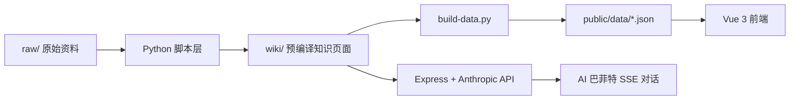

# 苏墨-巴菲特知识库架构

## 模块说明

- `raw/`：信件、访谈、概念、公司、人物、索引数据
- `wiki/`：带 frontmatter 的 Markdown Wiki，可在 Obsidian 中直接打开
- `code/*.py`：转换、清洗、摄取、索引维护
- `code/web/`：Vue 3 展示层和 Express API

## 数据流

1. 原始 Markdown 放入 `raw/`
2. Python 脚本将可直接复用的页面转换到 `wiki/`
3. AI 摄取脚本为长文生成结构化摘要页
4. `build-data.py` 将 `wiki/` 编译为前端 JSON 与页面副本
5. Vue 站点浏览知识图谱，Express 基于预编译知识做对话检索
